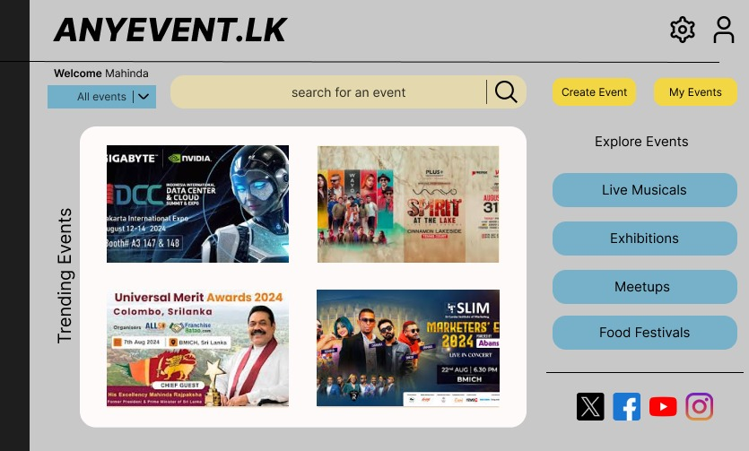

# 🎟️ Event Management System



## Overview

The Event Management System is a university project designed to demonstrate the use of microservices architecture using Spring Boot. The system enables users to browse, book, and manage tickets for various events like musical shows, concerts, and theater performances. Organizers can create and manage events, while the system tracks ticket sales and user interactions.

## 🏗️ Microservices Architecture

The application is divided into the following microservices:

1. **👤 User Service**: Handles user registration, authentication, and profile management.
2. **🎫 Event Service**: Manages the creation, editing, and retrieval of events.
3. **🛒 Ticket Service**: Manages the booking, cancellation, and retrieval of tickets.
4. **💳 Payment Service**: Processes payments and maintains payment history.
5. **🔔 Notification Service**: Sends notifications to users about bookings, cancellations, and event updates.
6. **📊 Analytics Service**: Tracks user interactions, ticket sales, and event metrics.

## 🌟 Key Features

- **👤 User Service**:
  - **Register**: `POST /api/users/register`
    - Request: `User` object
    - Response: Registered `User` object
  
  - **Login**: `POST /api/users/login`
    - Parameters: `email`, `password`
    - Response: JSON with `message` and `sessionId` or error message
  
  - **Check Status**: `GET /api/users/status`
    - Response: Login status message
  
  - **Logout**: `POST /api/users/logout`
    - Response: Logout success message
  
  - **Get User by ID**: `GET /api/users/id/{id}`
    - Path Variable: `id`
    - Response: `User` object or `404 Not Found`
  
  - **Get User by Email**: `GET /api/users/email/{email}`
    - Path Variable: `email`
    - Response: `User` object or `404 Not Found`
  
  - **Update User Name**: `PUT /api/users/update-name`
    - Parameters: `email`, `newName`
    - Response: Success or `404 Not Found`
  
  - **Update User Role**: `PUT /api/users/update-role`
    - Parameters: `email`, `newRole`
    - Response: Success or `404 Not Found`
  
  - **Delete User**: `DELETE /api/users/delete`
    - Parameters: `email`
    - Response: Success or `404 Not Found`

---

- **🎫 Event Service**:
  - CRUD operations for event management.
  - List and detailed view of events.
  - RESTful endpoints: `/events`, `/events/{id}`.
  
- **🛒 Ticket Service**:
  - Booking, viewing, and cancellation of tickets.
  - RESTful endpoints: `/tickets`, `/tickets/{id}`, `/tickets/user/{userId}`.
  
- **💳 Payment Service**:
  - Processes payments for ticket bookings.
  - RESTful endpoints: `/payments`, `/payments/user/{userId}`, `/payments/ticket/{ticketId}`.
  
- **🔔 Notification Service**:
  - Sends notifications related to bookings, cancellations, and updates.
  - RESTful endpoints: `/notifications`, `/notifications/user/{userId}`, `/notifications/{id}`.
  
- **📊 Analytics Service**:
  - Tracks and analyzes user interactions and sales metrics.
  - RESTful endpoints: `/analytics/user/{userId}`, `/analytics/event/{eventId}`, `/analytics/ticket/{ticketId}`.

## 💻 Technologies Used

- **Backend**: Spring Boot, Spring Data JPA, Spring Security
- **Frontend**: React
- **Database**: MySQL
- **API Design**: RESTful APIs
- **Other**: Maven

## 🗂️ Project Structure

```markdown
event-management-system/
|
├── backend/                              # 🖥️ Contains all the Spring Boot microservices
|   |
│   ├── user-service/                     # 👤 Microservice for user management
│   │   ├── src/
│   │   │   ├── main/
│   │   │   │   ├── java/
│   │   │   │   │   └── lk/nibm/userservice/    # 📂 Java package for User Service
│   │   │   │   │       ├── controller/         # 🚏 REST controllers for handling HTTP requests
│   │   │   │   │       ├── service/            # 🛠️ Business logic and service classes
│   │   │   │   │       ├── model/              # 🗄️ Entity models representing database tables
│   │   │   │   │       └── repository/         # 📚 Repository interfaces for database operations
│   │   │   │   └── resources/
│   │   │   │       ├── application.properties  # ⚙️ Configuration file for Spring Boot
│   │   │   └── test/
│   │   │       └── java/
│   │   │           └── lk/nibm/userservice/    # 🧪 Unit and integration tests for User Service
│   │   └── pom.xml                            # 📝 Maven build file for User Service
│   ├── event-service/                         # 🎫 Microservice for event management
│   ├── ticket-service/                        # 🛒 Microservice for ticket management
│   ├── payment-service/                       # 💳 Microservice for payment processing
│   ├── notification-service/                  # 🔔 Microservice for sending notifications
│   └── analytics-service/                     # 📊 Microservice for analytics and reporting
|
├── frontend/                                  # 🌐 React frontend application
│   ├── public/
│   │   ├── index.html                         # 📄 Main HTML file for the React app
│   │   └── favicon.ico                        # 🔖 Favicon for the React app
│   ├── src/
│   │   ├── components/                        # 🧩 Reusable UI components (e.g., Navbar, Footer)
│   │   ├── pages/                             # 📑 Pages representing different views (e.g., HomePage, EventPage)
│   │   ├── services/                          # 🛠️ API service modules for interacting with backend
│   │   ├── App.js                             # 🏠 Main application component
│   │   ├── index.js                           # 🚀 Entry point for the React application
│   │   └── styles/                            # 🎨 CSS or SCSS stylesheets for the application
│   ├── package.json                           # 📦 Project dependencies and scripts for the React app
│   └── .env                                   # 🌍 Environment variables for frontend configuration
|
└── misc/                                      # 🗃️ Miscellaneous files (e.g., images, SQL scripts)
```

## 🔧 Requirements

- **Backend**: Java 17+ and Maven
- **Frontend**: Node.js and npm (or yarn)

## 🏗️ Setup Instructions

### Backend (IntelliJ IDEA)

1. **Clone the Repository**:
   ```bash
   git clone https://github.com/YourUsername/event-management-system.git
   cd event-management-system
   ```

2. **Import Project into IntelliJ**:
   - Open IntelliJ IDEA.
   - Select `File` -> `Open` and choose the root directory of the project.
   - IntelliJ will automatically detect the Maven project and import all sub-modules.

3. **Run the Application**:
   - Navigate to the `backend` directory within IntelliJ IDEA.
   - Open the `Application.java` class (or the main class of your microservice).
   - Click the `Run` button or use `Shift + F10` to start the application.

4. **Verify the Application**:
   - Check that the application starts without errors and the required ports are open.

### Frontend (VSCode)

1. **Clone the Repository**:
   ```bash
   git clone https://github.com/YourUsername/event-management-system.git
   cd event-management-system/frontend
   ```

2. **Install Dependencies**:
   ```bash
   npm install
   ```

3. **Run the Application**:
   ```bash
   npm start
   ```

4. **Verify the Application**:
   - Open a browser and navigate to `http://localhost:3000` to see the React application in action.

## 📬 API Testing

You can test the API endpoints using the provided Postman collection. 

- **Postman Collection**: [Event Management System Collection](https://api.postman.com/collections/37875992-09aebe1a-c819-4d18-85b2-62cdd8c0f326?access_key=PMAT-01J64CN9CZW2QZESH9ES1HTFC5)

Import this collection into Postman to explore and test the API endpoints for the Event Management System.

## 🤝 Project Contributors

- [Chiranaka](https://github.com/Chiranaka)
- [Kdinekshi](https://github.com/Kdinekshi)
- [litheetha](https://github.com/litheetha)
- [sasindu423](https://github.com/sasindu423)
- [thebooleanguy](https://github.com/thebooleanguy)
